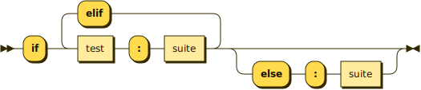
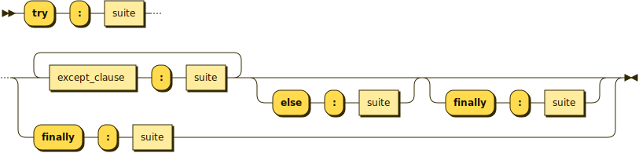

# Trako

[](https://www.donmccurdy.com/2023/07/03/expectations-in-open-source/)&ensp;[](https://www.donmccurdy.com/2023/07/03/expectations-in-open-source/#maturity)&ensp;[](https://www.donmccurdy.com/2023/07/03/expectations-in-open-source/#development)&ensp;[](https://www.donmccurdy.com/2023/07/03/expectations-in-open-source/#support)

### _Update: Nowadays, the original [RR](https://github.com/GuntherRademacher/rr) is available on Maven Central and offers an embeddable library. Therefore, this fork has served its purpose._ 🎉 

-----

Trako is a generator of syntax diagrams, also known as railroad diagrams.

Besides generating diagrams from EBNF rules, Trako can also perform some grammar transformation, e.g. factorization
and elimination of direct recursion. To some extent this transforms BNF to EBNF, yielding more compact diagrams.

️Trako is based on the excellent [RR](https://github.com/GuntherRademacher/rr) by Gunther Rademacher. Trako was created to make the RR diagram generator available to other applications and to add distribution via Maven Central. Since [PR #14](https://github.com/GuntherRademacher/rr/pull/14) and [PR #22](https://github.com/GuntherRademacher/rr/pull/22) were merged, _**Trako is no longer needed.**_ ⚠️

By the way, the name "Trako" is the word for "track" in [Esperanto](https://en.wikipedia.org/wiki/Esperanto).

## Examples

Here are two examples of generated diagrams (taken from the [Python grammar][PYTHON]):

**if_stmt:**



**try_stmt:**



## Grammar syntax

Trako accepts grammars in [W3C-style EBNF][W3C-EBNF]. Some other representations, including
some parser generator input notations, can be converted to W3C-style using
[Grammar Conversion][CONVERT].

## Distribution

There are two flavors of Trako: a library for use with other applications and an all-in-one JAR for CLI use. Both are
available on Maven Central.

[](https://maven-badges.herokuapp.com/maven-central/com.github.bannmann.trako/trako)

In the examples below, `VERSION` must be replaced with the desired version.

### Library usage

via Maven:

```
<dependency>
    <groupId>com.github.bannmann.trako</groupId>
    <artifactId>trako</artifactId>
    <version>VERSION</version>
</dependency>
```

### CLI usage

To generate a diagram, run e.g.

```bash
   java -jar trako-VERSION-all.jar grammar.ebnf
```

For listing the full set of available options, run

```bash
   java -jar trako-VERSION-all.jar
```
without further command line arguments.

## License

Trako is released under the [Apache 2 License][ASL].


[ASL]: http://www.apache.org/licenses/LICENSE-2.0
[PYTHON]: https://docs.python.org/3/reference/grammar.html
[W3C-EBNF]: http://www.w3.org/TR/2010/REC-xquery-20101214/#EBNFNotation
[CONVERT]: http://bottlecaps.de/convert/
[SAXON]: http://www.saxonica.com/products/products.xml
[BATIK]: https://xmlgraphics.apache.org/batik/
[GRADLE]: https://gradle.org/
